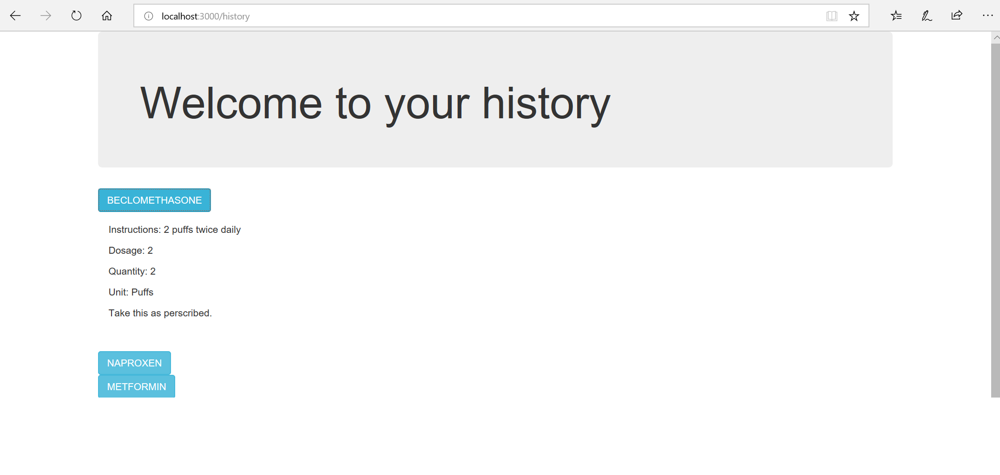

= Manual
Individual-Health-Record _Team Awesome_
Fall 2018 CS6440
:toc:
== Cover Page

.IHR
****

*Individual Health Record*

****

.Website
----

https://cs6440-f18-prj11.apps.hdap.gatech.edu/

----

* Team Awesome 

** _Joseph Honea_

** _Eric I-Hsin_

** _Dionisios Gizas_

** _Emma Yuhan Zhang_ 
+

footnote:[This Manual is for website end user. For matainance and development please see special instruction]

FHIR server example patient: http://hapi.fhir.org/baseDstu3/Patient?gender=female&given=John&family=Doe&birthdate=1990-11-06&_pretty=true

<<<
== Login Page
_IHR will provide one stop shop for patient to get their medical information from anywhere._ +
_IHR also protect health informtion privacy._ +

.loginpage
image::loginpage.png[Login Page]

click the login button, the user will be prompted to input their credentials. 

<<<

== OAuth login
_We choose OAuth because it provides users security, also it is convenient for the users to avoid extra memorization effort_

.OAuth First time

The user put their email and password to login. +
Currently we are using Microsoft, future the website can add other OAuth like Google, Facebook etc.

<<<

== Main Page
_After login, the user is directed to the main page. Here the user will have different areas to explore_ +
dashboard +
history +
add resource +
.mainpage +

<<<

== Dashboard
_Dashboard is the place to provide users graphic visualtion of their health status_ +
 
_Below we can see vertical bar chart represents our patient John Doe's medication intake summary by dosage period_ +
_just one possiblity to display quantified data_ +

.Vertical Bar Chart

<<<

_Below another example using horizontal bar chart_ +
_represents medication by administration method_ +

.Horizontal Bar Chart

<<<

_An interesting donut chart below display all the medications of John_ +
_The interactive part like you click a legend to diminish or add back the slice of the medication. For example, like Aspirin in image below_ +

.Donut Chart

<<<

== History
_History is the resource with condensed historic health information_ +

History page focus on detialed information of medication paitient is taking or take before, in the form of list +
User can click on each medication to expand the detials.
  

.History

<<<

== UserDataEntry
_The page of user data entry provide a portal for users to sending the indentifying information_ +

.UserDataEntry

Using that information, through authenticifaction, health information in the EHR server is extracted to local database +
After that the user could see the display of their health information in various ways