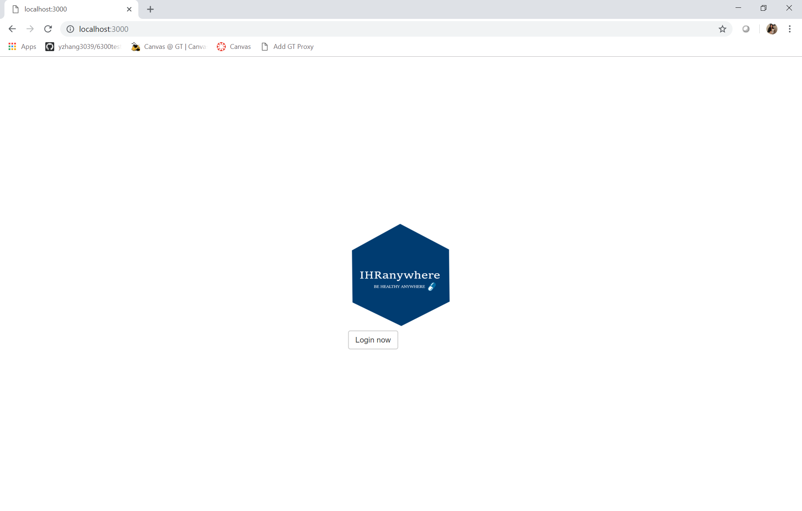

= Special Instruction
Individual-Health-Record _Team Awesome_
Fall 2018 CS6440
:toc:
== Setup the docker

=== Download and shared drive

1. Go to the website to download install file +
https://www.docker.com/products/docker-desktop
+

2. Right click the docker icon, click "Settings"
+

3. Click "Shared Drive", you can check C drive.

=== Setup Kitematic

1. Right click the docker icon, click "Kitematic" +

2. Click "Download", then extract the zipfile downloaded.
+

3. Copy the extracted folder inside the Docker folder, e.g. C:\Program Files\Docker. +
Then rename the folder as "Kitematic", remove the os part of name.

=== Run Container Using Compose

1. go to top level directory of the repository pulled from team repo. +
https://github.gatech.edu/gt-cs6440-hit-fall2018/Individual-Health-Record-IHR-Prototype 
+

2. In powershell, navigate to the project folder level, run "_docker-compose build_"

+
3. Then run "_docker-compose up_"

The database container and the main web app container will be built and started

<<<
=== Start the Webpage

Open a broswer, http://localhost:3000 +
*You should be ablet to see the website now!* 

.Website

<<<

.Development
****
Following are the special instructions for carrying on development work
****

==  Node.js

For contiunue on development code, you need to install Node.js +
		https://nodejs.org/en/download/ +
		
Node.js is for write applications in JavaScript on the server +

=== Install Package
NPM is included in the Node.js installation. 

In the ihr-webap level: _Individual-Health-Record-IHR-Prototype/ihr-webap_

run "_npm install_" , then 

run "_npm start_" 

=== View the Website
Now Open a broswer, type "localhost:3000" in the address bar +
You should be ablet to see the website now, similar to running docker <<Start the Webpage, to the login page>>
 
== View and Edit Source Code

=== Download tool
We recommend Visual Visual Studio, or VS code
https://visualstudio.microsoft.com/downloads/

.Project Structure
image::projectINVS.png[Visual Studio Proejct Screenshot]

==  MongoDB
Here is the MongoDB download page

https://www.mongodb.com/download-center/community