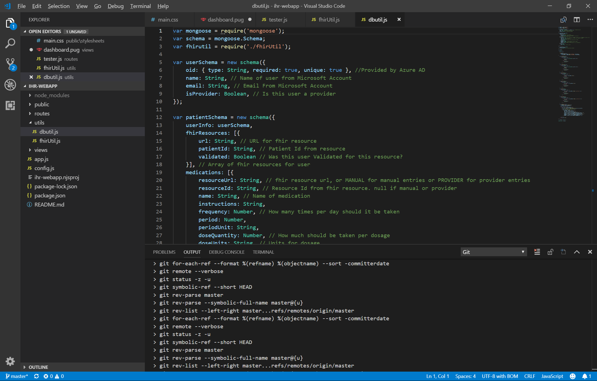

= Catalog
Individual-Health-Record _Team Awesome_
Fall 2018 CS6440
:toc:
== Cover Page

Team Awesome +

.IHR
****
*Individual Health Record*
****

Github Link +
https://github.gatech.edu/gt-cs6440-hit-fall2018/Individual-Health-Record-IHR-Prototype 

.Team Members
|===
|Name |Role

|Joseph Honea
|Developer, QA

|Eric I-Hsin
|QA, Developer

|Dionisios Gizas
|Developer, PM

|Emma Yuhan Zhang
|PM, Analyst, QA
|===
<<<
== Project Structure
* ihr-webapp
** node_modules

** public

*** images  

*** js		
**** chartCreator.js
**** listCreator.js

** routes
*** dashboard.js
*** history.js
*** login.js
*** logout.js
*** tester.js
*** UserDataEntry.js

** utils
*** dbutil.js
*** fhirUtil.js

** views
*** dashboard.pug
*** history.pug
*** index.pug
*** login.pug
*** UserDataEntry.pug

** app.js
** config.js
** ihr-webapp.njsproj
** package JSON
** package-lock JSON
** README.txt

* Reasearch

* Document

* .dockerignore

* docker-compose.yml

* ihr-webapp.sln

* ihr-webappdb-docker

* ihr-webapp-docker

* Jenkinsfile

* package-lock

* README

.Project Structure

<<<
== Elements

=== ihr-webapp

==== node_modules
Local install puts package and dependency in this folder

****
****

==== public

===== images  
folder for images used in website

===== js		

====== chartCreator.js
javascript for create chart to display user health information. +
different cases for different chart types, build data models, assign colors, labels, etc

====== listCreator.js
javascript for create list to display user health information. +
functions to clean data, put data into list.

****
****

==== routes
folder for javascript files used for each webpage

===== dashboard.js
javascript for dashboard webpage, function call to the chart

===== history.js
javascript for history webpage

===== login.js
javascript for login webpage, to handle user login, authentication etc.

===== logout.js
javascript for logout webpage, to handle log out.

===== tester.js
javascript for tester webpage, to get patient information like medication from FHIR.

===== UserDataEntry.js
javascript for user data entry webpage

****
****

==== utils
folder for javascript contains database utility

===== dbutil.js
javascript for database webpage

===== fhirUtil.js
javascript for FHIR server webpage

****
****

==== views
folder for pug files. +
Pug is a template engine for Node.js, the template engine allows us to inject data and then produce HTML.

===== dashboard.pug
pug file for dashboard page, have different charts represent patient medication.

===== history.pug
pug file for history page, for display medication history.

===== index.pug
pug file for index page

===== login.pug
pug file for login page,dynamically handle login and display

===== UserDataEntry.pug
pug file for UserDataEntry page， take the user input for the entry page. +
ser use this page to enter name, birthday, gender, email and server to store information so can retrieve from server.

<<<

==== app.js
javascript to run the app

==== config.js
javascript for some configuration

==== ihr-webapp.njsproj
njsproj file that run VS up with additional help that’s specific to Node.js

==== package JSON
JSON file for package 

==== package-lock JSON
JSON file for package dependency

==== README.txt
readme file automatically generated

=== Reasearch
folder that keep all the past research done for the project

=== Document
folder that keep all the adoc files and pdf based on adoc files

=== .dockerignore
file to list files and directories to exclude

=== docker-compose.yml
config file for docker-compose. +
It allows to deploy, combine and configure multiple docker-container at the same time

=== ihr-webapp.sln
structure file used for organizing projects in Microsoft Visual Studio

=== ihr-webappdb-docker
docker file for database

=== ihr-webapp-docker
docker file

=== Jenkinsfile
File that helps to automate the non-human part of the software development process, +
with continuous integration and facilitating technical aspects of continuous delivery

=== package-lock
lock version

=== README
readme file automatically generated
<<<